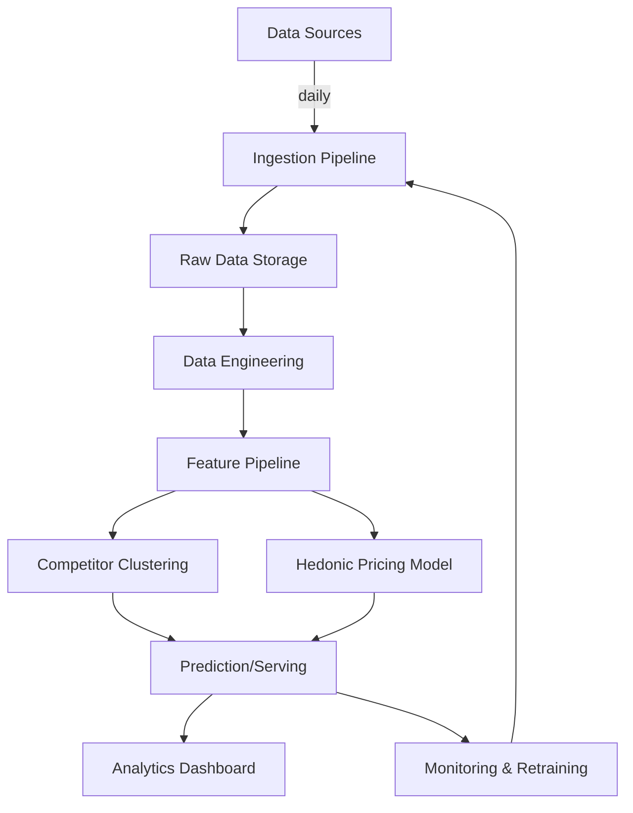

# Tourism Pricing Analytics: Competitor Clustering & Hedonic Price Benchmarking

### Summary
A machine learning pipeline with the purpose of providing pricing analytics for a client tourism business in Crete. Two core modelling approaches are used. Firstly, clustering is used on property listing features (e.g. price, beach distance, amenities, distance to urban centres, pools, room sizes etc), to acquire a close-competitor set for the client. 

Secondly, a hedonic pricing model is employed, which is essentially a regression model, so as to glean a price benchmark or approximate fair-market value. Data is scraped on a rolling basis from online travel agency listings for tourism properties in Crete, Greece. Time-varying features are required so to update regression estimates and most recent pricing. The ultimate goal is to use this information to feed a daily dashboard of competitor behaviour and fair market price which in turn informs pricing for the client business using the dashboard.

### Motivation
The client business has little information to inform pricing strategy. Competitor information is limited to high-noise sources, like checking sites of presumed competitors or using overview dashboards on Booking.com or similar, which does not provide competitor pricing. Real-time competitor pricing behaviour would be a strong market signal to inform the client business' prices. They also want to know what features explain the differences in price between competitors, to have some indication of possible price pushers.

### Objectives
The main project objective is:
> To develop a live system that identifies competitor businesses, estimates feature importance & market value of features, and lastly provides a dashboard for up-to-date insights.

This can be broken down into further sub-objectives:
1. Design and deploy an automated data ingestion pipeline that regularly scrapes listing-level market data (prices, amenities, location, and availability windows).
2. Build a data engineering component for schema validation, data quality checks, deduplication, and loading.
3. Define and maintain a feature pipeline for both static and time-varying predictors used in clustering and hedonic modelling.
4. Competitor identification logic using clustering (or nearest-neighbour style similarity) on property-level feature space.
5. Train and evaluate a hedonic pricing model to estimate benchmark market value and interpret feature-level price effects.
6. Establish experiment tracking and model versioning so model runs are reproducible and comparable over time.
7. Orchestrate scheduled retraining and batch scoring workflows to keep estimates and competitor sets up to date.
8. Implement monitoring for data freshness, data quality, drift indicators, and model performance degradation.
9. Deliver a dashboard/data product that provides competitor pricing behaviour, fair-value gaps, and feature-driven insights for pricing decisions.
10. Document the full system (data sources, assumptions, limitations, and runbooks).

### Design Overview
