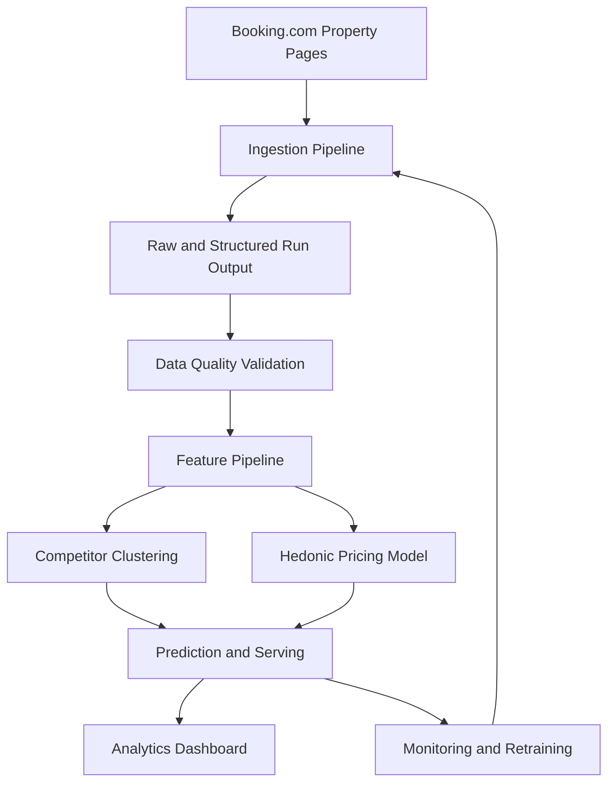

# Tourism Pricing Analytics

Tourism Pricing Analytics is a pricing-intelligence project for tourism properties in Crete. The long-term goal is to collect reliable market data, identify close competitors, estimate fair market value with interpretable models, and expose pricing signals through a dashboard.

The current implementation focus is Booking.com ingestion. The scraper collects a stable room inventory and dated rate rows for configured properties, preserves raw and normalized price fields, classifies failures explicitly, and writes structured JSONL output for downstream analytics.

## Project Goals

The project is designed around one main objective:

> Build a live system that identifies competitor businesses, estimates feature importance and market value, and provides up-to-date pricing insights for decision-making.

That objective breaks down into these stages:

1. Scrape listing-level market data, starting with Booking.com property pages.
2. Store raw and structured records with enough context to audit parser behavior.
3. Validate data quality before any modelling or dashboard work.
4. Build static and time-varying feature pipelines.
5. Identify competitors using clustering or nearest-neighbour similarity.
6. Estimate hedonic pricing models for market-value benchmarking.
7. Monitor data freshness, parser drift, and model drift.
8. Deliver a dashboard for competitor prices, fair-value gaps, and feature effects.

## Current Status

The repository is in the scraper-hardening phase.

Completed so far:

- Booking.com scraper configuration lives in `config/booking_scraper_config.json`.
- Reusable scraper logic has moved into `tourism_pricing_analytics/scraping/booking/`.
- `notebooks/property_page_scraper.py` remains as a thin manual entrypoint.
- Unit and fixture tests cover URL construction, config loading, price parsing, parser behavior, failure classification, and runner failure recording.
- Scraper output is written as JSONL under `saved_dom/runs/<timestamp>/`.
- Failure cases are classified into machine-readable categories and saved in `failures.jsonl`.
- Small representative HTML fixtures live under `data/sample/raw_html/`.

Next major engineering step:

- Add structured run-output validation helpers for generated JSONL run directories, with tests for required files, duplicate room records, missing fields, impossible prices, per-night calculations, and failure snapshot references.

## Repository Layout

```text
.
|-- config.py
|-- config/
|   `-- booking_scraper_config.json
|-- data/
|   `-- sample/raw_html/
|-- docs/
|   `-- scraping/
|-- notebooks/
|   |-- exploring_listings.ipynb
|   `-- property_page_scraper.py
|-- tests/
|-- tourism_pricing_analytics/
|   `-- scraping/booking/
`-- README.md
```

Key files and directories:

- `config.py`: repository path constants.
- `config/booking_scraper_config.json`: scraper seed, browser settings, date windows, occupancy defaults, and configured property targets.
- `tourism_pricing_analytics/scraping/booking/`: reusable Booking.com scraping package.
- `notebooks/property_page_scraper.py`: compatibility entrypoint for manually running the scraper.
- `tests/`: standard-library `unittest` coverage.
- `data/sample/raw_html/`: small saved HTML fixtures used by parser and failure-classification tests.
- `docs/scraping/scraper_design.md`: scraper design notes, DOM findings, scrape strategy, and generated-output retention policy.
- `docs/scraping/next_pass_refactor_plan.md`: current hardening plan and acceptance criteria.
- `saved_dom/runs/`: generated scrape runs and debug artifacts. This directory is intentionally ignored by Git.

## Booking Scraper Architecture

The scraper is organized around three responsibilities:

1. Browser orchestration: page navigation, cookie handling, response status capture, recovery, and scrolling.
2. Parsing: pure extraction and normalization logic for room inventory and price rows.
3. Persistence: run directory creation, JSONL serialization, logging, failure output, and debug DOM snapshots.

Current package modules:

- `models.py`: dataclasses for scraper config, output records, failure categories, and failure records.
- `config.py`: config loading from JSON into typed dataclasses.
- `urls.py`: canonical property URLs, dated URLs, room-inventory URLs, date-window generation, and slug helpers.
- `parsing.py`: whitespace normalization, price parsing, per-night price calculation, room inventory extraction, and dated price row extraction.
- `failures.py`: pure failure-classification helpers and a Playwright page adapter.
- `io.py`: run directories, logging setup, JSONL writing, failure writing, and DOM snapshot saving.
- `browser.py`: Playwright navigation, cookie dismissal, page recovery, response capture, and scrolling.
- `runner.py`: scraper orchestration for room inventory and price loops.

## Scrape Strategy

The scraper uses two loops.

### Room Inventory Loop

Purpose:

- Build a stable catalog of room types for each property.

Approach:

- Load each property URL without `checkin` or `checkout` query parameters.
- Dismiss cookie UI when present.
- Parse room anchors like `a[href^="#RD"]`.
- De-duplicate room ids.
- Save `RoomInventoryRecord` rows.

Why it matters:

- Dated pages may hide sold-out rooms.
- Undated pages are better for capturing the full room-type catalog.

### Price Collection Loop

Purpose:

- Capture dated bookable rates for configured future stay windows.

Approach:

- Build dated property URLs directly with query parameters.
- Avoid clicking Booking.com's calendar.
- Iterate over configured lead times and stay lengths.
- Parse rate rows from `tr.js-rt-block-row`.
- Carry room ids/names forward across rate rows in the same room group.
- Save raw text and normalized numeric price fields.

Important interpretation:

- Booking.com exposes total stay prices, not nightly prices.
- `price_per_night` is derived from total price divided by stay length.
- Rate rows are commercial products, not just rooms. One room can have multiple rate rows for cancellation, breakfast, board, or package variants.

## Configuration

The active scraper config is `config/booking_scraper_config.json`.

Current configured defaults:

- Random seed: `10001`
- Output root: `saved_dom`
- Lead times: `1`, `7`, `14`, `30`, and `60` days
- Stay lengths: `4`, `7`, and `14` nights
- Occupancy: `2` adults, `0` children, `1` room
- Browser: Playwright Chromium, currently configured as non-headless
- Configured properties:
  - Solimar Aquamarine Resort
  - Elia Daliani

Keep scraper behavior configurable here rather than hard-coding property lists, dates, browser settings, or occupancy defaults in parser code.

## Outputs

Each scraper run creates a timestamped directory under:

```text
saved_dom/runs/<timestamp>/
```

Typical files:

- `room_inventory.jsonl`: run-level room inventory records.
- `price_rows.jsonl`: run-level dated rate rows.
- `failures.jsonl`: run-level failure records.
- `scrape_debug.log`: scraper log output.
- `<property_index>_<property_slug>/`: per-property outputs and debug snapshots.

The generated run directory is local evidence, not project history. Keep only what is useful for debugging or validation. Promote only small representative HTML samples into `data/sample/raw_html/` when they protect durable parser or failure-classification behavior.

## Output Record Concepts

Room inventory records include:

- `property_name`
- `property_url`
- `room_id`
- `room_name`
- `captured_at`

Price row records include:

- property and capture context
- `checkin`, `checkout`, `lead_time_days`, `stay_length_days`
- room identifiers where available
- `block_id`
- occupancy, conditions, and scarcity text
- raw current and original price text
- normalized current and original price values
- `price_per_night`
- quantity options

Failure records include:

- property and requested URL context
- scrape stage: room inventory or price rows
- failure category and reason
- final URL and HTTP status when available
- date-window context where relevant
- debug snapshot filename when saved
- exception type and message when an exception was involved

Failure categories currently include:

- `empty_availability`
- `selector_drift`
- `redirect`
- `blocked_challenge`
- `partial_load`
- `temporary_booking_error`
- `navigation_error`
- `extraction_error`

## Setup

Use Python 3.10 or newer.

On Windows PowerShell:

```powershell
.\.venv\Scripts\Activate.ps1
pip install -e ".[dev]"
python -m playwright install chromium
```

If the virtual environment does not exist yet:

```powershell
python -m venv .venv
.\.venv\Scripts\Activate.ps1
python -m pip install --upgrade pip
pip install -e ".[dev]"
python -m playwright install chromium
```

The project currently uses only the standard library plus Playwright. Tests use standard-library `unittest`.

## Common Commands

Run the full test suite:

```powershell
python -m unittest discover -s tests
```

Run focused tests:

```powershell
python -m unittest tests.test_price_parsing
python -m unittest tests.test_scraper_config_and_urls
python -m unittest tests.test_booking_parser_fixtures
python -m unittest tests.test_failure_classification
python -m unittest tests.test_runner_failure_recording
```

Compile-check the entrypoint, config, package modules, and tests:

```powershell
python -m py_compile notebooks\property_page_scraper.py config.py tourism_pricing_analytics\__init__.py tourism_pricing_analytics\scraping\__init__.py tourism_pricing_analytics\scraping\booking\__init__.py tourism_pricing_analytics\scraping\booking\models.py tourism_pricing_analytics\scraping\booking\config.py tourism_pricing_analytics\scraping\booking\urls.py tourism_pricing_analytics\scraping\booking\parsing.py tourism_pricing_analytics\scraping\booking\failures.py tourism_pricing_analytics\scraping\booking\io.py tourism_pricing_analytics\scraping\booking\browser.py tourism_pricing_analytics\scraping\booking\runner.py tests\test_booking_parser_fixtures.py tests\test_failure_classification.py tests\test_price_parsing.py tests\test_runner_failure_recording.py tests\test_scraper_config_and_urls.py
```

Run the scraper manually:

```powershell
python notebooks\property_page_scraper.py
```

Compatibility import check:

```powershell
python -c "from notebooks.property_page_scraper import normalize_price_text; print(normalize_price_text('EUR 1,095'))"
```

Expected output:

```text
1095.0
```

## Testing Policy

Tests use standard-library `unittest`.

Test files:

- `tests/test_price_parsing.py`
- `tests/test_scraper_config_and_urls.py`
- `tests/test_booking_parser_fixtures.py`
- `tests/test_failure_classification.py`
- `tests/test_runner_failure_recording.py`

Current fixture coverage:

- `data/sample/raw_html/elia_palatino_listing_page.html`: room inventory and dated price-row parser coverage.
- `data/sample/raw_html/elia_daliani_empty_availability.html`: compact empty-availability failure-classification coverage.
- `data/sample/raw_html/listings_chania.html`: saved listing-page sample for exploration.

Phase-completion rule:

- After each completed implementation phase, run a full relevant test sweep before starting the next phase.
- Do not treat a live smoke run as enough when a change can affect parser output, serialization, failure classification, or data correctness.
- Add regression tests for live-output bugs before scaling the scrape.

Recommended sweep for scraper behavior changes:

1. Focused unit or fixture tests for the changed behavior.
2. `python -m unittest discover -s tests`
3. Full `python -m py_compile` check.
4. Compatibility import check when public compatibility imports are touched.
5. Rigorous live validation when browser behavior, parser selectors, failure classification, or output semantics are affected.

## Data Quality Expectations

Before scraped data feeds downstream analytics, validate:

- no duplicate `(property_url, room_id)` inventory records within a run
- no missing room ids or room names in room inventory
- no missing `checkin`, `checkout`, `stay_length_days`, or `captured_at` in price rows
- no negative prices
- no zero or near-zero normalized prices when raw price text contains a visible positive total
- `price_per_night` matches normalized total price divided by stay length
- raw price and condition text are preserved alongside normalized values
- rows with null `room_id` are reviewed before modelling
- failure records have populated categories
- snapshot filenames referenced by failure records exist when a snapshot was expected

The next planned implementation step is to make these checks executable as structured run-output validation helpers.

## Documentation

Useful project docs:

- `docs/scraping/scraper_design.md`: Booking.com DOM findings, scrape strategy, output retention policy, and risk notes.
- `docs/scraping/next_pass_refactor_plan.md`: current hardening roadmap and acceptance criteria.
- `session_notes.md`: requested handoff/status snapshot. This file is replaced when updated, not appended as a changelog.
- `AGENTS.md` and `CLAUDE.md`: local coding-agent instructions and development discipline.

Use commits and PRs as the source of change history. Do not maintain a running change log.

## Design Overview



## Roadmap

Near-term scraper hardening:

1. Add structured run-output validation helpers and tests.
2. Add more representative fixtures for selector drift and discounted rate rows.
3. Strengthen data-quality checks around missing room ids, price normalization, and per-night calculations.
4. Run rigorous live validation against the configured small property set.
5. Review live-output gaps before expanding the property list.

Medium-term ingestion work:

1. Add candidate property discovery from Booking.com search results.
2. Improve property URL canonicalization and metadata capture.
3. Decide storage format and loading path for downstream analytics.
4. Add scheduled ingestion and run monitoring.

Longer-term analytics work:

1. Build static property feature tables.
2. Build time-varying price and availability feature tables.
3. Implement competitor clustering or nearest-neighbour matching.
4. Train and evaluate hedonic pricing models.
5. Build dashboard views for competitor behavior and fair-value gaps.

## Security And Data Handling

- Do not commit credentials, private client data, or large generated scrape runs.
- Keep generated output under `saved_dom/runs/` local and ignored by Git.
- Promote only small representative fixtures to `data/sample/raw_html/`.
- Preserve enough raw text in structured outputs to audit parser and normalization behavior.
- Treat live Booking.com DOM behavior as unstable. Any new live bug should become a regression test before scale increases.
