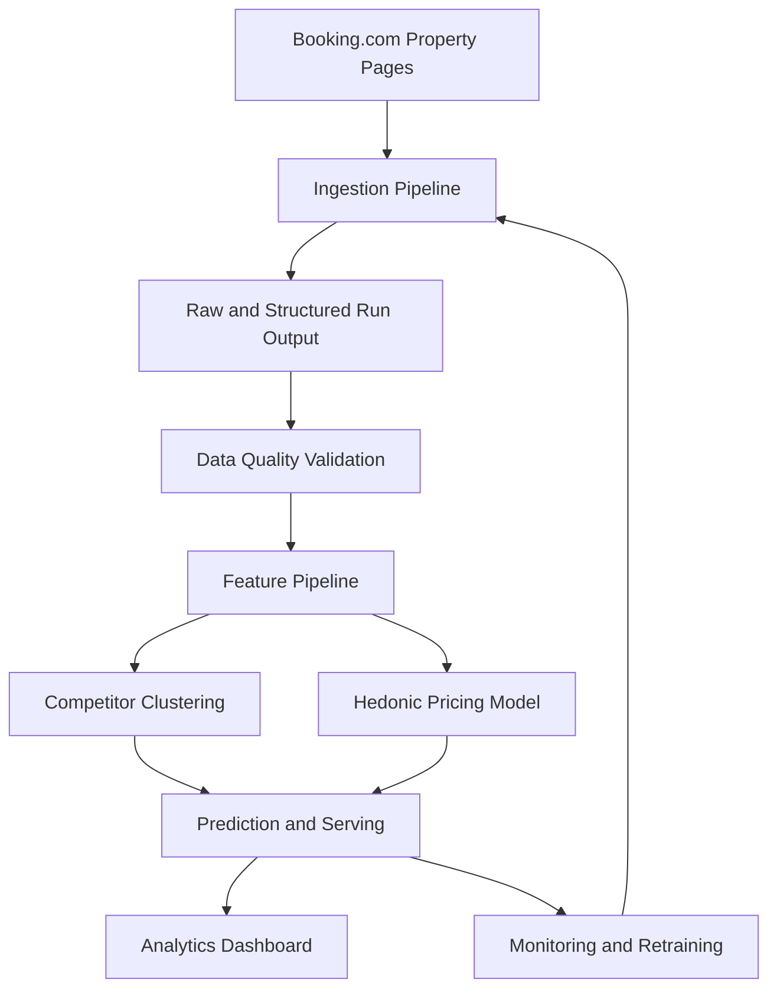

# Tourism Pricing Analytics

Tourism Pricing Analytics is a pricing-intelligence project for tourism properties in Crete. The long-term goal is to collect reliable market data, identify close competitors, estimate fair market value with interpretable models, and expose pricing signals through a dashboard.

The current implementation focus is Booking.com ingestion. The scraper collects a stable room inventory and dated rate rows for configured properties, preserves raw and normalized price fields, classifies failures explicitly, and writes structured JSONL output for downstream analytics.

A first downstream analytics phase is also built on top of a completed scrape: a competitive-positioning benchmark and a supporting hedonic adjustment/explanation layer for a Chania self-catering operator. See the [Analytics](#analytics-post-scraping-modelling) section below.

## Project Goals

The project is designed around one main objective:

> Build a live system that identifies competitor businesses, estimates feature importance and market value, and provides up-to-date pricing insights for decision-making.

That objective breaks down into these stages:

1. Scrape listing-level market data, starting with Booking.com property pages.
2. Store raw and structured records with enough context to audit parser behavior.
3. Validate data quality before any modelling or dashboard work.
4. Build static and time-varying feature pipelines.
5. Identify competitors using clustering or nearest-neighbour similarity.
6. Estimate hedonic pricing models for market-value benchmarking.
7. Monitor data freshness, parser drift, and model drift.
8. Deliver a dashboard for competitor prices, fair-value gaps, and feature effects.

## Current Status

The scraper is production-scale and the first downstream analytics phases are
built. The operational focus is now **accumulating repeated daily scrapes** so
the competitor price-movement layer gains history.

Completed so far:

- Booking.com scraper configuration lives in `config/booking_scraper_config.json`
  and targets 377 Chania/Gerani properties across five lead times and three stay
  lengths.
- The scale-up config `config/booking_scraper_config_chania_full.json` preserves
  those baseline/client targets first, including **Stavros Villas & Apartments**,
  then appends discovered Chania candidates for 788 unique targets on the reduced
  7/30/60 x 4/7 matrix.
- Reusable scraper logic lives in `tourism_pricing_analytics/scraping/booking/`;
  `notebooks/property_page_scraper.py` remains a thin manual entrypoint.
- Structured run-output validation writes a `validation_report.json` per run, and
  each run builds a `modelling_table.jsonl` via the Layer 2 feature join.
- A downstream analytics layer (`tourism_pricing_analytics/analysis/`) delivers a
  comparables-first competitive-positioning benchmark and a supporting hedonic
  adjustment/explanation model, exposed through reports, an Excel workbook, a
  positioning narrative, and a local dashboard. See the
  [Analytics](#analytics-post-scraping-modelling) section.
- **Phase 4 competitor price-movement monitoring** (roadmap Phases 0-4 complete):
  append-only movement-history stores, snapshot comparison, property-weighted
  peer-market movement, transparent/deterministic pricing signals, an
  `/api/movements` service route, and a compact **Price Movements** dashboard tab.
- Unit, fixture, and analytics tests cover the scraper, feature pipeline, and the
  movement/dashboard layers.

Current operational step:

- Run the daily scrape and append its snapshot to the movement-history stores so
  movement comparisons accumulate (see [Repeated-Scrape Workflow](#repeated-scrape-workflow)).

## Repository Layout

```text
.
|-- config.py
|-- config/
|   `-- booking_scraper_config.json
|-- data/
|   `-- sample/raw_html/
|-- docs/
|   `-- scraping/
|-- notebooks/
|   |-- exploring_listings.ipynb
|   `-- property_page_scraper.py
|-- tests/
|-- tourism_pricing_analytics/
|   `-- scraping/booking/
`-- README.md
```

Key files and directories:

- `config.py`: repository path constants.
- `config/booking_scraper_config.json`: scraper seed, browser settings, date windows, occupancy defaults, and configured property targets.
- `tourism_pricing_analytics/scraping/booking/`: reusable Booking.com scraping package.
- `notebooks/property_page_scraper.py`: compatibility entrypoint for manually running the scraper.
- `tests/`: standard-library `unittest` coverage.
- `data/sample/raw_html/`: small saved HTML fixtures used by parser and failure-classification tests.
- `docs/scraping/scraper_design.md`: scraper design notes, DOM findings, scrape strategy, and generated-output retention policy.
- `docs/scraping/booking_scraper_roadmap.md`: staged build/hardening/scale roadmap and acceptance criteria.
- `saved_dom/runs/`: generated scrape runs and debug artifacts. This directory is intentionally ignored by Git.

## Booking Scraper Architecture

The scraper is organized around three responsibilities:

1. Browser orchestration: page navigation, cookie handling, response status capture, recovery, and scrolling.
2. Parsing: pure extraction and normalization logic for room inventory and price rows.
3. Persistence: run directory creation, JSONL serialization, logging, failure output, and debug DOM snapshots.

Current package modules:

- `models.py`: dataclasses for scraper config, output records, failure categories, and failure records.
- `config.py`: config loading from JSON into typed dataclasses.
- `urls.py`: canonical property URLs, dated URLs, room-inventory URLs, date-window generation, and slug helpers.
- `parsing.py`: whitespace normalization, price parsing, per-night price calculation, room inventory extraction, and dated price row extraction.
- `failures.py`: pure failure-classification helpers and a Playwright page adapter.
- `io.py`: run directories, logging setup, JSONL writing, failure writing, and DOM snapshot saving.
- `browser.py`: Playwright navigation, cookie dismissal, page recovery, response capture, and scrolling.
- `runner.py`: scraper orchestration for room inventory and price loops.

## Scrape Strategy

The scraper uses two loops.

### Room Inventory Loop

Purpose:

- Build a stable catalog of room types for each property.

Approach:

- Load each property URL without `checkin` or `checkout` query parameters.
- Dismiss cookie UI when present.
- Parse room anchors like `a[href^="#RD"]`.
- De-duplicate room ids.
- Save `RoomInventoryRecord` rows.

Why it matters:

- Dated pages may hide sold-out rooms.
- Undated pages are better for capturing the full room-type catalog.

### Price Collection Loop

Purpose:

- Capture dated bookable rates for configured future stay windows.

Approach:

- Build dated property URLs directly with query parameters.
- Avoid clicking Booking.com's calendar.
- Iterate over configured lead times and stay lengths.
- Parse rate rows from `tr.js-rt-block-row`.
- Carry room ids/names forward across rate rows in the same room group.
- Save raw text and normalized numeric price fields.

Important interpretation:

- Booking.com exposes total stay prices, not nightly prices.
- `price_per_night` is derived from total price divided by stay length.
- Rate rows are commercial products, not just rooms. One room can have multiple rate rows for cancellation, breakfast, board, or package variants.

## Configuration

The active scraper config is `config/booking_scraper_config.json`.

Current configured defaults:

- Random seed: `10001`
- Output root: `saved_dom`
- Lead times: `1`, `7`, `14`, `30`, and `60` days
- Stay lengths: `4`, `7`, and `14` nights
- Occupancy: `2` adults, `0` children, `1` room (all prices are 2-guest nightly
  rates; whole-villa / large-party pricing is under-served pending a future
  varied-occupancy re-scrape)
- Browser: Playwright Chromium. This baseline config runs non-headless (handy for
  small targeted/client passes); the full scrape config and
  `scripts/run_full_scrape.py` default to **headless with 8 workers**, the
  fastest and most memory-efficient profile per the 2026-07-05 A/B (see
  `session_notes.md`)
- Configured properties: 377 Chania/Gerani/Crete targets (Chania town, Gerani,
  Platanias, Agia Marina, Maleme, and neighbouring west-coast areas), including
  the client subject **Stavros Villas & Apartments**

The scale-up config `config/booking_scraper_config_chania_full.json` is generated
from this baseline plus `data/sample/listings_chania_candidates.csv`; baseline
targets are preserved first and candidate URLs are appended after canonical
deduplication.

Keep scraper behavior configurable here rather than hard-coding property lists, dates, browser settings, or occupancy defaults in parser code.

## Outputs

Each scraper run creates a timestamped directory under:

```text
saved_dom/runs/<timestamp>/
```

Typical files:

- `room_inventory.jsonl`: run-level room inventory records.
- `price_rows.jsonl`: run-level dated rate rows.
- `failures.jsonl`: run-level failure records.
- `scrape_debug.log`: scraper log output.
- `<property_index>_<property_slug>/`: per-property outputs and debug snapshots.

The generated run directory is local evidence, not project history. Keep only what is useful for debugging or validation. Promote only small representative HTML samples into `data/sample/raw_html/` when they protect durable parser or failure-classification behavior.

Sharded runs launched via `scripts/run_full_scrape.py` also enrich the run's
`run_metadata.json` at finalize (settings, timing, status, result roll-ups) and
upsert one row per run into the git-tracked `data/run_registry.jsonl`. Inspect
the run history with:

```powershell
python scripts\list_runs.py
python scripts\list_runs.py --backfill saved_dom\runs\<run_dir>   # seed historical runs
```

## Output Record Concepts

Room inventory records include:

- `property_name`
- `property_url`
- `room_id`
- `room_name`
- `captured_at`

Price row records include:

- property and capture context
- `checkin`, `checkout`, `lead_time_days`, `stay_length_days`
- room identifiers where available
- `block_id`
- occupancy, conditions, and scarcity text
- raw current and original price text
- normalized current and original price values
- `price_per_night`
- quantity options

Failure records include:

- property and requested URL context
- scrape stage: room inventory or price rows
- failure category and reason
- final URL and HTTP status when available
- date-window context where relevant
- debug snapshot filename when saved
- exception type and message when an exception was involved

Failure categories currently include:

- `empty_availability`
- `selector_drift`
- `redirect`
- `blocked_challenge`
- `partial_load`
- `temporary_booking_error`
- `navigation_error`
- `extraction_error`

## Analytics (Post-Scraping Modelling)

A downstream analytics layer turns a completed scrape into competitive-pricing
advice for one Chania self-catering operator. It is **comparables-first**: a
peer price benchmark is the headline, and an interpretable hedonic model
supports it by feature-adjusting comps and decomposing price gaps. Every figure
is **EUR/night for a 2-guest booking** based on *listed asking prices for
available offers* -- positioning, not demand or revenue optimization.

Pipeline (all on the committed `data/modelling/modelling_table.parquet`):

1. `analysis/loader.py` -- load, decode nested columns, validate invariants.
2. `analysis/segment.py` -- keep the self-catering segment.
3. `analysis/competitors.py` -- peer set (geo + feature similarity) and the
   benchmark price distribution / percentile (headline).
4. `analysis/hedonic.py` -- OLS market premia, grouped-CV gradient boosting,
   feature-adjusted comps, and explained-plus-residual gap decomposition.
5. `analysis/narrative.py` + scripts -- client-facing reports, an Excel
   workbook, a positioning narrative, and a local dashboard.

For the full as-built method, rationale, outputs, and interpretation guidance
(including the asking-price caveat, villa 2-guest under-coverage, and known
model limitations), see
[docs/analytics/modelling_approach.md](docs/analytics/modelling_approach.md).
The original staged plan is in
[docs/analytics/pricing_analytics_roadmap.md](docs/analytics/pricing_analytics_roadmap.md).

### View the dashboard

The local dashboard is the main productized output: an interactive competitive
positioning and price-movement view over the committed modelling table.

```powershell
.\.venv\Scripts\Activate.ps1
python scripts\run_dashboard.py                 # serves http://127.0.0.1:8765/
python scripts\run_dashboard.py --port 8800 --no-browser
```

It is a zero-dependency stdlib `http.server` app that fits the hedonic model
once at startup, then re-runs only the cheap peer benchmark per selection. It
reads the committed `data/modelling/modelling_table.parquet` plus the
`hedonic_training_table.parquet`; the **Price Movements** tab additionally uses
the git-ignored movement-history stores produced by the workflow below. See
[data/modelling/README.md](data/modelling/README.md) for what it serves and how
to rebuild those tables.

## Repeated-Scrape Workflow

Phase 4 adds a competitor price-movement layer over repeated scrapes. Each day,
scrape the configured properties and append the snapshot to the append-only
movement-history stores, then view the dashboard:

```powershell
.\.venv\Scripts\Activate.ps1
python notebooks\property_page_scraper.py
python scripts\append_price_observations.py --latest
python scripts\run_dashboard.py
```

- The scrape writes generated run artifacts under `saved_dom/runs/<timestamp>/`.
- The append updates `data/modelling/price_observations.parquet` and
  `data/modelling/offer_presence.parquet` (git-ignored generated operating
  history; deduped by snapshot/property/window/occupancy identity, so re-running
  a run is safe).
- The **Price Movements** dashboard tab shows a clear low-history state until at
  least two comparable snapshots exist; comparisons appear once a stay window is
  observed on two different snapshot dates.
- Optional external context can be supplied at
  `data/modelling/demand_covariates.csv`; a missing file is valid and reports
  `No external covariates loaded.`

See [data/modelling/README.md](data/modelling/README.md) for the rebuild command
and real-run validation notes.

For dashboard refreshes after a full scrape plus retry pass, build the durable
table from all relevant runs in order, with later retry/client runs replacing
earlier rows for the same property:

```powershell
python scripts\export_modelling_table.py `
  --run-dir saved_dom\runs\<full_run> `
  --run-dir saved_dom\runs\<retry_run> `
  --run-dir saved_dom\runs\<client_targeted_run>
```

## Setup

Use Python 3.10 or newer.

On Windows PowerShell:

```powershell
.\.venv\Scripts\Activate.ps1
pip install -e ".[dev]"
python -m playwright install chromium
```

If the virtual environment does not exist yet:

```powershell
python -m venv .venv
.\.venv\Scripts\Activate.ps1
python -m pip install --upgrade pip
pip install -e ".[dev]"
python -m playwright install chromium
```

The project currently uses only the standard library plus Playwright. Tests use standard-library `unittest`.

## Common Commands

Run the full test suite:

```powershell
python -m unittest discover -s tests
```

Run focused tests:

```powershell
python -m unittest tests.test_price_parsing
python -m unittest tests.test_scraper_config_and_urls
python -m unittest tests.test_booking_parser_fixtures
python -m unittest tests.test_failure_classification
python -m unittest tests.test_runner_failure_recording
```

Compile-check the entrypoint, config, package modules, and tests:

```powershell
python -m py_compile notebooks\property_page_scraper.py config.py tourism_pricing_analytics\__init__.py tourism_pricing_analytics\scraping\__init__.py tourism_pricing_analytics\scraping\booking\__init__.py tourism_pricing_analytics\scraping\booking\models.py tourism_pricing_analytics\scraping\booking\config.py tourism_pricing_analytics\scraping\booking\urls.py tourism_pricing_analytics\scraping\booking\parsing.py tourism_pricing_analytics\scraping\booking\failures.py tourism_pricing_analytics\scraping\booking\io.py tourism_pricing_analytics\scraping\booking\browser.py tourism_pricing_analytics\scraping\booking\runner.py tests\test_booking_parser_fixtures.py tests\test_failure_classification.py tests\test_price_parsing.py tests\test_runner_failure_recording.py tests\test_scraper_config_and_urls.py
```

Run the scraper manually:

```powershell
python notebooks\property_page_scraper.py
```

Compatibility import check:

```powershell
python -c "from notebooks.property_page_scraper import normalize_price_text; print(normalize_price_text('EUR 1,095'))"
```

Expected output:

```text
1095.0
```

## Testing Policy

Tests use standard-library `unittest`.

Test files:

- `tests/test_price_parsing.py`
- `tests/test_scraper_config_and_urls.py`
- `tests/test_booking_parser_fixtures.py`
- `tests/test_failure_classification.py`
- `tests/test_runner_failure_recording.py`

Current fixture coverage:

- `data/sample/raw_html/elia_palatino_listing_page.html` (~2 MB): room inventory,
  dated price-row, and room/property feature-extractor coverage. Kept as a full
  page on purpose — `test_booking_parser_fixtures.py`,
  `test_room_feature_extractors.py`, and `test_property_feature_extractors.py`
  assert exact extracted values, which need the complete availability widget,
  facilities section, and surroundings/policies blocks intact.
- `data/sample/raw_html/selected_suites_discounted_page.html` (~1.8 MB): full
  page backing discounted/price-row and room-feature exact-value regression
  tests; kept whole for the same reason.
- `data/sample/raw_html/elia_daliani_empty_availability.html`: compact empty-availability failure-classification coverage.
- `data/sample/raw_html/listings_chania_sample.html`: trimmed listing-page
  fixture used by `test_listings_parser.py`.
- The full region dump `listings_chania.html` (7.6 MB) is **not committed** — it
  is only used for ad-hoc notebook exploration (whose findings are already saved
  in `notebooks/exploring_listings.ipynb`), so it is git-ignored and kept
  local-only rather than carried in the repo.

Phase-completion rule:

- After each completed implementation phase, run a full relevant test sweep before starting the next phase.
- Do not treat a live smoke run as enough when a change can affect parser output, serialization, failure classification, or data correctness.
- Add regression tests for live-output bugs before scaling the scrape.

Recommended sweep for scraper behavior changes:

1. Focused unit or fixture tests for the changed behavior.
2. `python -m unittest discover -s tests`
3. Full `python -m py_compile` check.
4. Compatibility import check when public compatibility imports are touched.
5. Rigorous live validation when browser behavior, parser selectors, failure classification, or output semantics are affected.

## Data Quality Expectations

Before scraped data feeds downstream analytics, validate:

- no duplicate `(property_url, room_id)` inventory records within a run
- no missing room ids or room names in room inventory
- no missing `checkin`, `checkout`, `stay_length_days`, or `captured_at` in price rows
- no negative prices
- no zero or near-zero normalized prices when raw price text contains a visible positive total
- `price_per_night` matches normalized total price divided by stay length
- raw price and condition text are preserved alongside normalized values
- rows with null `room_id` are reviewed before modelling
- failure records have populated categories
- snapshot filenames referenced by failure records exist when a snapshot was expected

These checks are executable in `tourism_pricing_analytics/scraping/booking/validation.py`
and are reported per run in `validation_report.json`.

## Documentation

Useful project docs:

- `docs/scraping/scraper_design.md`: Booking.com DOM findings, scrape strategy, output retention policy, and risk notes.
- `docs/scraping/booking_scraper_roadmap.md`: staged build/hardening/scale roadmap and acceptance criteria.
- `docs/analytics/modelling_approach.md`: as-built post-scraping modelling approach -- method, reasons, outputs, and how to interpret them.
- `docs/analytics/pricing_analytics_roadmap.md`: staged plan for the downstream competitive-pricing analytics.
- `session_notes.md`: requested handoff/status snapshot. This file is replaced when updated, not appended as a changelog.
- `AGENTS.md` and `CLAUDE.md`: local coding-agent instructions and development discipline.

Use commits and PRs as the source of change history. Do not maintain a running change log.

## Design Overview



## Roadmap

Done (scraper + analytics Phases 0-4): production-scale Booking.com scraping,
structured run validation, the Layer 2 modelling table, the comparables
benchmark, the hedonic adjustment/explanation layer, client-facing reports and
dashboard, and the Phase 4 competitor price-movement monitoring layer. See
[docs/analytics/pricing_analytics_roadmap.md](docs/analytics/pricing_analytics_roadmap.md).

Current operational focus:

1. Accumulate repeated daily scrapes and append each snapshot to the
   movement-history stores so movement comparisons gain history.
2. Watch for parser/selector drift across repeated live runs.

Future direction (out of scope for now):

1. Varied-occupancy re-scrape for whole-villa / large-party pricing (the 2-guest
   data under-serves villas).
2. Fixed-window daily cadence enabling demand-aware pricing beyond positioning.
3. Clustering-based market segmentation reusing the Phase 2 proximity/similarity
   machinery.

## Security And Data Handling

- Do not commit credentials, private client data, or large generated scrape runs.
- Keep generated output under `saved_dom/runs/` local and ignored by Git.
- Promote only small representative fixtures to `data/sample/raw_html/`.
- Preserve enough raw text in structured outputs to audit parser and normalization behavior.
- Treat live Booking.com DOM behavior as unstable. Any new live bug should become a regression test before scale increases.
